# Swift NSWindow Style Showcase

[](https://github.com/apple/swift)
[](https://developer.apple.com/macos/)
[](https://github.com/lukakerr)

A showcase of many of the different styles of windows possible with NSWindow on MacOS. In some examples, NSToolbar, and NSVisualEffectView are used. No private API's are used.

To test each style, clone the project, open it in Xcode, uncomment each block of code in `WindowController.swift` and run. The numbers above each block correspond to each style below.

All code is in `WindowController.swift` in the `windowDidLoad` function. You should just be able to place each block inside that function to get the exact same result.

If you have a style to add, please make a pull request.

### 1. Hide title

Don't show the title text in the titlebar.

<p align="center">
  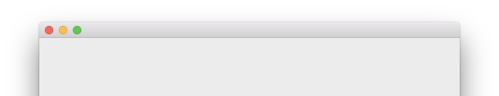
</p>

```swift
window?.titleVisibility = .hidden
```

### 2. Hide titlebar

Hide the titlebar completely.

<p align="center">
  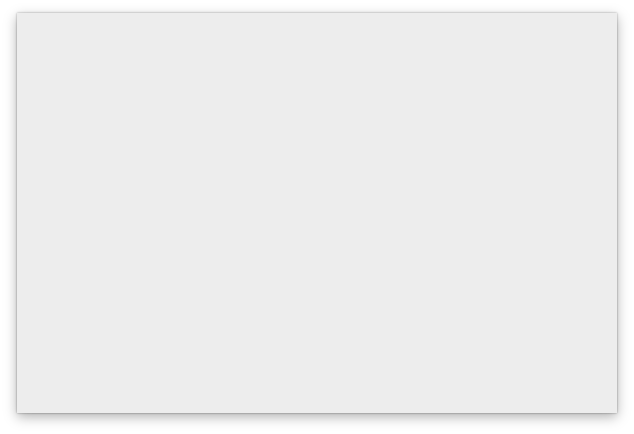
</p>

```swift
window?.styleMask.remove(.titled)
```

### 3. Vibrant background

Create a vibrant background where whatever is behind the window can be slightly seen. This uses `NSVisualEffectView`.

<p align="center">
  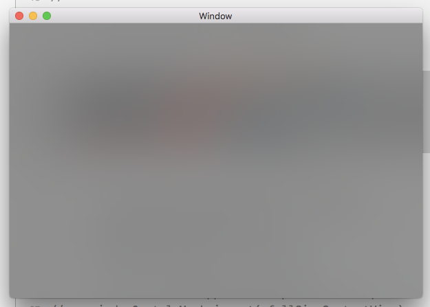
</p>

```swift
let visualEffect = NSVisualEffectView()
visualEffect.blendingMode = .behindWindow
visualEffect.state = .active
visualEffect.material = .dark
window?.contentView = visualEffect
```

`visualEffect.material` can take multiple values including:

- `.appearanceBased`: based on the views appearance
- `.dark`: dark appearance
- `.ultraDark`: ultra dark appearance
- `.light`: light appearance
- `.mediumLight`: medium light appearance
- others such as `.menu`, `.popover`, `.selection`, `.sidebar` and `.titlebar`

### 4. Vibrant background with transparent titlebar

Same as above, with a transparent titlebar.

<p align="center">
  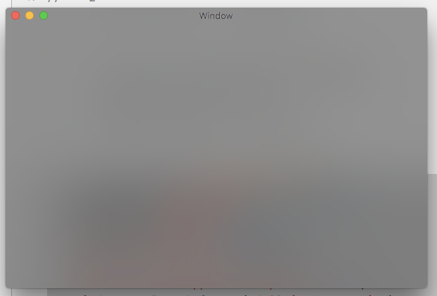
</p>

```swift
let visualEffect = NSVisualEffectView()
visualEffect.blendingMode = .behindWindow
visualEffect.state = .active
visualEffect.material = .dark
window?.contentView = visualEffect

window?.titlebarAppearsTransparent = true
window?.styleMask.insert(.fullSizeContentView)
```

### 5. Vibrant background without titlebar

Same as above, without the titlebar.

<p align="center">
  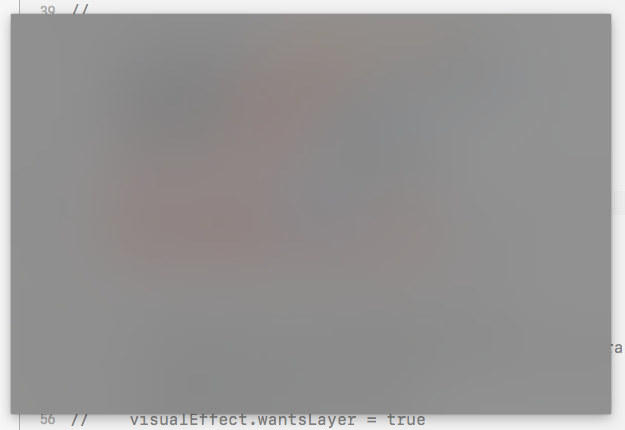
</p>

```swift
let visualEffect = NSVisualEffectView()
visualEffect.blendingMode = .behindWindow
visualEffect.state = .active
visualEffect.material = .dark
window?.contentView = visualEffect

window?.styleMask.remove(.titled)
window?.isMovableByWindowBackground = true
```

### 6. Vibrant background with border radius and no titlebar

A vibrant window with a custom border radius. The border radius value can be changed at `visualEffect.layer?.cornerRadius = 16.0`.

<p align="center">
  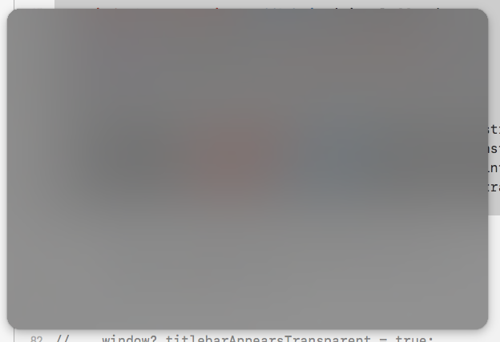
</p>

```swift
let visualEffect = NSVisualEffectView()
visualEffect.translatesAutoresizingMaskIntoConstraints = false
visualEffect.material = .dark
visualEffect.state = .active
visualEffect.wantsLayer = true
visualEffect.layer?.cornerRadius = 16.0

window?.titleVisibility = .hidden
window?.styleMask.remove(.titled)
window?.backgroundColor = .clear
window?.isMovableByWindowBackground = true

window?.contentView?.addSubview(visualEffect)

guard let constraints = window?.contentView else {
  return
}

visualEffect.leadingAnchor.constraint(equalTo: constraints.leadingAnchor).isActive = true
visualEffect.trailingAnchor.constraint(equalTo: constraints.trailingAnchor).isActive = true
visualEffect.topAnchor.constraint(equalTo: constraints.topAnchor).isActive = true
visualEffect.bottomAnchor.constraint(equalTo: constraints.bottomAnchor).isActive = true
```

### 7. Transparent titlebar

A window with a transparent titlebar.

<p align="center">
  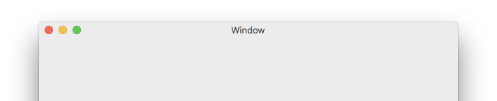
</p>

```swift
window?.titlebarAppearsTransparent = true
```

### 8. Transparent titlebar with background color

Same as above with a background color.

<p align="center">
  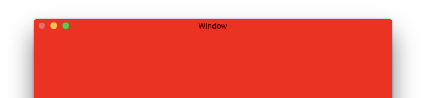
</p>

```swift
window?.titlebarAppearsTransparent = true
window?.backgroundColor = .red
```

### 9. Toolbar

A window with a toolbar.

<p align="center">
  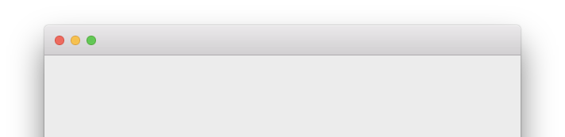
</p>

```swift
let customToolbar = NSToolbar()
window?.titleVisibility = .hidden
window?.toolbar = customToolbar
```

### 10. Transparent toolbar

Same as above, with the toolbar transparent.

<p align="center">
  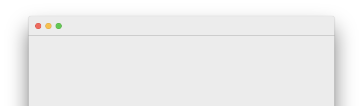
</p>

```swift
let customToolbar = NSToolbar()
window?.titlebarAppearsTransparent = true
window?.titleVisibility = .hidden
window?.toolbar = customToolbar
```

### 11. Transparent toolbar without seperator

Same as above, without the toolbar seperator.

<p align="center">
  
</p>

```swift
let customToolbar = NSToolbar()
customToolbar.showsBaselineSeparator = false
window?.titlebarAppearsTransparent = true
window?.titleVisibility = .hidden
window?.toolbar = customToolbar
```

### 12. Transparent toolbar with background color and without seperator

Same as above, with a background color.

<p align="center">
  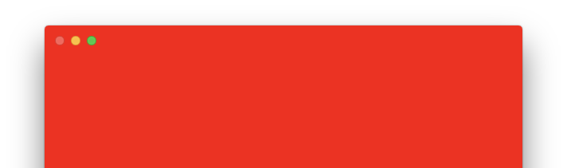
</p>

```swift
let customToolbar = NSToolbar()
customToolbar.showsBaselineSeparator = false
window?.titlebarAppearsTransparent = true
window?.titleVisibility = .hidden
window?.backgroundColor = .red
window?.toolbar = customToolbar
```

### 13. Translucent toolbar

A translucent toolbar allowing for content behind the toolbar to be slightly seen.

<p align="center">
  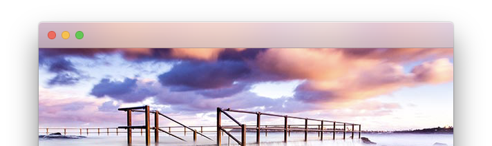
</p>

```swift
let customToolbar = NSToolbar()
window?.titleVisibility = .hidden
window?.styleMask.insert(.fullSizeContentView)
window?.contentView?.wantsLayer = true
window?.contentView?.layer?.contents = NSImage(named: NSImage.Name(rawValue: "Background"))
window?.toolbar = customToolbar
```

### 14. Translucent titlebar

Same as above with a titlebar instead of a toolbar.

<p align="center">
  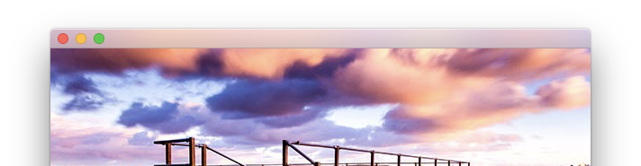
</p>

```swift
window?.titleVisibility = .hidden
window?.styleMask.insert(.fullSizeContentView)
window?.contentView?.wantsLayer = true
window?.contentView?.layer?.contents = NSImage(named: NSImage.Name(rawValue: "Background"))
```

### 15. Transparent titlebar without title

Same as above with a transparent titlebar.

<p align="center">
  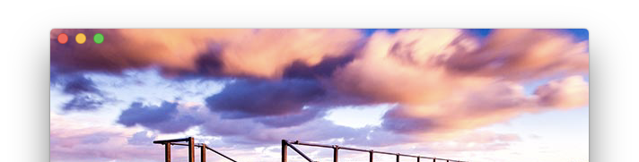
</p>

```swift
window?.titleVisibility = .hidden
window?.styleMask.insert(.fullSizeContentView)
window?.titlebarAppearsTransparent = true
window?.contentView?.wantsLayer = true
window?.contentView?.layer?.contents = NSImage(named: NSImage.Name(rawValue: "Background"))
```
### 16. macOS Mojave dark mode

The macOS Mojave dark mode appearance.

<p align="center">
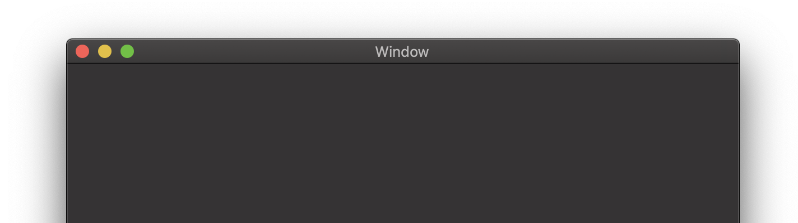
</p>

```swift
if #available(OSX 10.14, *) {
  window?.appearance = NSAppearance(named: .darkAqua)
}
```
